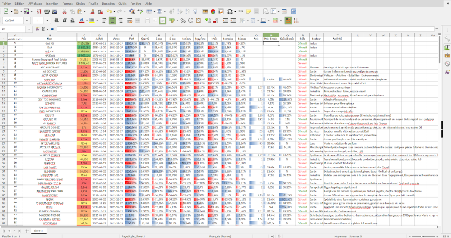
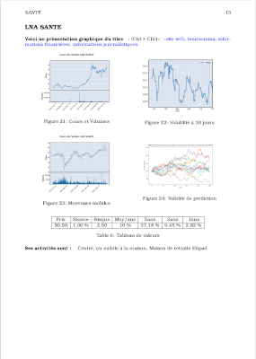

# Financial_review

# Installation
```
$python venv .venv
$source .venv/bin/activate
$pip install -r requirements.txt
python main.py
```
Pour créer la base de données, dans main.py exécuter create_db
Pour mettre à jour la base de données, dans main.py exécuter maj_db
Pour un rapport texte, exécuter text_report()
Pour un rapport excel, exécuter excel_report()
Pour un rapport pdf, exécuter pdf_report()
Pour utiliser une api, exécuter api_report(), nécissite un abonnement.

Régler le portefeuille dans le fichier selection.txt, ou laisser tout le fichier commenter pour exécuter l’ensemble du dictionnaire des actions.

## Description
Élément d’analyse financière par automatisation de plusieurs rapports. Partie nécessitant le driver chrome de [Selenium](https://selenium-python.readthedocs.io/) commentée.

## Détails
L’objectif du logiciel est de fournir un tableau synoptique,
et un rapport plus complet, moyennant plus de temps de calcul, mais incluant notamment la volatilité à 30 jours et une simulation Monte-Carlo pour chaque valeur.

Tableau synoptique :



Rapport complet :


